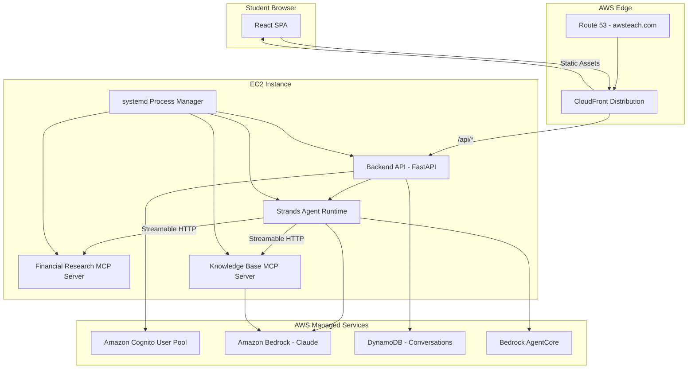
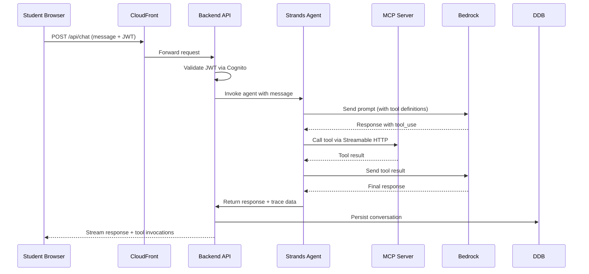

# Design Document

## Overview

This design describes a demo application for a one-day AWS class "Building Agentic AI with Amazon Bedrock AgentCore" for Ameriprise Financial employees. The system consists of a web portal (served via CloudFront at www.awsteach.com), a backend API, two MCP servers (Financial Research and Knowledge Base), and a conversational agent — all running on a single EC2 instance. Authentication is handled by Amazon Cognito, and observability is provided through Bedrock AgentCore's tracing and logging features.

The architecture prioritizes simplicity and demonstrability: everything runs on one machine, teardown is trivial, and students can observe the full lifecycle of an agentic AI request — from natural language input through tool orchestration to structured response.

### Key Design Decisions

1. **Single EC2 deployment**: All backend components co-located for simplicity. A process manager (systemd) handles service lifecycle.
2. **Strands Agents SDK (Python)**: Used for both the agent runtime and MCP server implementations, providing a unified framework.
3. **Streamable HTTP transport for MCP**: MCP servers communicate over HTTP on localhost, enabling the agent to connect via `StreamableHTTPClientTransport`. This simplifies debugging and allows students to inspect traffic.
4. **React SPA frontend**: Static assets served through CloudFront, with API calls proxied to the EC2 origin under `/api/*`.
5. **DynamoDB for conversation storage**: Serverless, no database server to manage on the instance, auto-scales for the class duration.

## Architecture



### Request Flow



## Components and Interfaces

### 1. Frontend (React SPA)

**Responsibility**: User interface for registration, authentication, chat, and trace visualization.

| Component | Description |
|-----------|-------------|
| `AuthModule` | Registration form, sign-in form, session management via Cognito SDK |
| `ChatInterface` | Message input, response display, streaming indicator |
| `ToolInvocationPanel` | Real-time display of MCP server name, tool name, status |
| `TraceViewer` | Visualization of agent reasoning steps and tool call sequence |
| `ConversationSidebar` | List of previous conversations, "New Conversation" button |

**Tech Stack**: React 18, TypeScript, Vite, TailwindCSS, AWS Amplify (Cognito integration)

### 2. Backend API (FastAPI)

**Responsibility**: Authentication verification, request routing, conversation persistence, WebSocket management for streaming.

```python
# API Interface
POST /api/auth/register       # Registration initiation
POST /api/auth/verify         # Email verification
POST /api/auth/signin         # Authentication
POST /api/auth/signout        # Session invalidation
POST /api/chat/message        # Send message to agent
GET  /api/chat/conversations  # List conversations (max 50)
GET  /api/chat/conversations/{id}  # Get conversation messages
POST /api/chat/conversations  # Create new conversation
GET  /api/chat/trace/{request_id}  # Get trace data for a request
```

**Tech Stack**: Python 3.12, FastAPI, uvicorn, boto3, pydantic

### 3. Financial Research MCP Server

**Responsibility**: Expose financial market data tools via MCP protocol.

**Tools Exposed**:
| Tool | Input | Output |
|------|-------|--------|
| `get_stock_quote` | `ticker: str` | `{price, change_pct, volume}` |
| `get_company_profile` | `ticker: str` | `{name, sector, market_cap, description}` |
| `get_market_summary` | None | `{indices: [{name, value, change_pct}], top_gainers: [ticker], top_losers: [ticker]}` |

**Tech Stack**: Python 3.12, Strands Agents SDK, `@tool` decorator, Streamable HTTP transport (port 8001)

**External Data Source**: Financial data API (e.g., Alpha Vantage or Yahoo Finance API)

### 4. Knowledge Base MCP Server

**Responsibility**: Expose RAG (retrieval-augmented generation) tools over AWS documentation and course materials.

**Tools Exposed**:
| Tool | Input | Output |
|------|-------|--------|
| `query_knowledge_base` | `query: str` (1-1000 chars) | `{passages: [{text, source_title, section_id, relevance_score}]}` |

**Tech Stack**: Python 3.12, Strands Agents SDK, `@tool` decorator, Streamable HTTP transport (port 8002), Amazon Bedrock Knowledge Bases

### 5. Strands Agent Runtime

**Responsibility**: Orchestrate natural language conversations using Bedrock foundation models, invoking MCP tools as needed.

```python
from strands import Agent
from strands.mcp import MCPClient
from strands.models.bedrock import BedrockModel

# Agent Configuration
model = BedrockModel(
    model_id="anthropic.claude-sonnet-4-20250514",
    region_name="us-east-1"
)

financial_mcp = MCPClient(
    transport="streamable_http",
    url="http://localhost:8001/mcp"
)

knowledge_mcp = MCPClient(
    transport="streamable_http",
    url="http://localhost:8002/mcp"
)

agent = Agent(
    model=model,
    tools=[financial_mcp, knowledge_mcp],
    max_tool_calls=10,
    system_prompt="You are a helpful AI assistant for an AWS class..."
)
```

**Constraints**:
- Maximum 10 tool invocations per student message
- 30-second timeout per request
- Emits trace spans for each tool invocation via AgentCore observability

### 6. Infrastructure Components

| Component | Configuration |
|-----------|--------------|
| CloudFront | TLS 1.2+, edge-cached static assets (max-age 86400s), `/api/*` forwarded to EC2 origin |
| Route 53 | A-alias records for `www.awsteach.com` and `awsteach.com` → CloudFront |
| Cognito | User pool with email verification, password policy, 60-min session tokens, 5-attempt lockout (15 min) |
| EC2 | Single instance, admin IAM role, systemd managing 4 services |
| DynamoDB | Conversations table, partition key: `user_id`, sort key: `conversation_id` |

## Data Models

### User (Cognito Managed)

```json
{
  "email": "string (primary identifier)",
  "display_name": "string (2-50 chars)",
  "email_verified": "boolean",
  "created_at": "ISO 8601 timestamp"
}
```

### Conversation

```json
{
  "user_id": "string (Cognito sub)",
  "conversation_id": "string (ULID)",
  "title": "string (auto-generated from first message)",
  "created_at": "ISO 8601 timestamp",
  "updated_at": "ISO 8601 timestamp"
}
```

### Message

```json
{
  "conversation_id": "string (ULID)",
  "message_id": "string (ULID)",
  "role": "user | assistant",
  "content": "string (1-2000 chars)",
  "tool_invocations": [
    {
      "mcp_server": "string",
      "tool_name": "string",
      "status": "pending | succeeded | failed",
      "duration_ms": "number",
      "input": "object",
      "output": "object | null"
    }
  ],
  "trace": {
    "total_latency_ms": "number",
    "tool_call_count": "number",
    "prompt_tokens": "number",
    "completion_tokens": "number",
    "spans": [
      {
        "name": "string",
        "mcp_server": "string | null",
        "tool_name": "string | null",
        "duration_ms": "number",
        "status": "success | failure"
      }
    ]
  },
  "timestamp": "ISO 8601 timestamp"
}
```

### DynamoDB Table Design

**Table: `agentcore-demo-conversations`**

| Attribute | Type | Key |
|-----------|------|-----|
| `PK` | String | Partition Key — `USER#{user_id}` |
| `SK` | String | Sort Key — `CONV#{conversation_id}` or `MSG#{message_id}` |
| `GSI1PK` | String | GSI1 Partition — `USER#{user_id}` |
| `GSI1SK` | String | GSI1 Sort — `UPDATED#{updated_at}` |
| `type` | String | `conversation` or `message` |
| `data` | Map | Full entity payload |
| `ttl` | Number | Epoch seconds (set to end of course + 7 days) |

**GSI1**: Used for listing conversations ordered by most recent activity.

### MCP Tool Response Models

**Stock Quote Response**:
```json
{
  "ticker": "string",
  "price": "number",
  "change_pct": "number",
  "volume": "number"
}
```

**Company Profile Response**:
```json
{
  "ticker": "string",
  "name": "string",
  "sector": "string",
  "market_cap": "number",
  "description": "string (max 500 chars)"
}
```

**Market Summary Response**:
```json
{
  "indices": [{"name": "string", "value": "number", "change_pct": "number"}],
  "top_gainers": ["string"],
  "top_losers": ["string"]
}
```

**Knowledge Base Query Response**:
```json
{
  "passages": [
    {
      "text": "string",
      "source_title": "string",
      "section_id": "string",
      "relevance_score": "number (0.0-1.0)"
    }
  ],
  "message": "string | null"
}
```

**MCP Error Response**:
```json
{
  "error_type": "string (e.g., 'INVALID_TICKER', 'DATA_SOURCE_UNAVAILABLE', 'INVALID_QUERY')",
  "message": "string"
}
```

## Correctness Properties

*A property is a characteristic or behavior that should hold true across all valid executions of a system — essentially, a formal statement about what the system should do. Properties serve as the bridge between human-readable specifications and machine-verifiable correctness guarantees.*

### Property 1: Registration input validation

*For any* registration form input where the email is not in valid email format, OR the password does not meet Cognito policy, OR the display name is shorter than 2 characters or longer than 50 characters, the system SHALL reject the submission and display an error message specific to the violated constraint.

**Validates: Requirements 1.5, 1.6, 1.8**

### Property 2: Expired token rejection

*For any* HTTP request bearing an expired session token, the system SHALL redirect the request to the sign-in page rather than processing it as an authenticated request.

**Validates: Requirements 2.6**

### Property 3: Stock quote response structure

*For any* valid ticker symbol, invoking the `get_stock_quote` tool on the Financial_Research_MCP SHALL return a response containing `price` (number), `change_pct` (number), and `volume` (number) fields.

**Validates: Requirements 3.3**

### Property 4: Company profile response structure and description length

*For any* valid ticker symbol, invoking the `get_company_profile` tool on the Financial_Research_MCP SHALL return a response containing `name`, `sector`, `market_cap`, and `description` fields, where `description` is no more than 500 characters.

**Validates: Requirements 3.4**

### Property 5: Invalid ticker error response

*For any* string that does not correspond to a valid ticker symbol, invoking a Financial_Research_MCP tool SHALL return a structured error containing an `error_type` field and a descriptive `message` indicating the symbol was not found.

**Validates: Requirements 3.5**

### Property 6: Knowledge base query response structure

*For any* valid query string (1-1000 characters), the `query_knowledge_base` tool SHALL return at most 5 passages, each containing `text`, `source_title`, `section_id`, and `relevance_score` fields.

**Validates: Requirements 4.3**

### Property 7: Relevance score filtering

*For any* knowledge base query, all returned passages SHALL have a `relevance_score` at or above 0.3, and if no passages meet this threshold, the result SHALL be an empty passage list with an explanatory message.

**Validates: Requirements 4.4, 4.5**

### Property 8: Knowledge base query validation

*For any* query string that is empty or exceeds 1000 characters, the Knowledge_Base_MCP SHALL return a structured error indicating the query is invalid, without attempting a knowledge base lookup.

**Validates: Requirements 4.7**

### Property 9: Agent tool invocation limit

*For any* student message processed by the Agent, the total number of tool invocations SHALL not exceed 10 for that single message processing cycle.

**Validates: Requirements 5.3**

### Property 10: Tool invocation display completeness

*For any* tool invocation (successful or failed) made by the Agent, the system SHALL present to the student the MCP server name, the tool name, and the invocation status (pending, succeeded, or failed).

**Validates: Requirements 5.4, 5.6**

### Property 11: Chat message length validation

*For any* message submission where the message is empty (0 characters) or exceeds 2000 characters, the system SHALL reject the submission and display a validation message indicating the allowed message length.

**Validates: Requirements 5.8**

### Property 12: Trace span completeness

*For any* tool invocation made by the Agent, the system SHALL emit a trace span containing the MCP server name, tool name, duration in milliseconds, and a success or failure status.

**Validates: Requirements 9.1**

### Property 13: Request observability metrics

*For any* completed Agent request, the observability data SHALL include total latency in milliseconds, number of tool calls, prompt token count, and completion token count.

**Validates: Requirements 9.4**

### Property 14: Message persistence ordering

*For any* sequence of messages within a conversation, persisting and then retrieving them SHALL return them in chronological order, with each message containing the original content (up to 2000 characters).

**Validates: Requirements 10.1**

### Property 15: Conversation list ordering and limit

*For any* student with conversations, retrieving the conversation list SHALL return conversations ordered by most recent activity, with the result capped at 50 conversations.

**Validates: Requirements 10.3**

### Property 16: Conversation isolation by user identity

*For any* two distinct authenticated users, retrieving conversations for one user SHALL never return conversations belonging to the other user.

**Validates: Requirements 10.5**

## Error Handling

### Frontend Error Handling

| Scenario | Behavior |
|----------|----------|
| Network failure | Display "Connection lost" toast, auto-retry with exponential backoff (max 3 retries) |
| Authentication expired | Redirect to sign-in page, preserve current URL for post-login redirect |
| Validation error | Inline field-level error messages, prevent form submission |
| Server 5xx | Display generic "Something went wrong" message with retry button |
| Chat timeout (30s) | Stop loading indicator, display timeout message, enable new message input |

### Backend API Error Handling

| Error Type | HTTP Status | Response Format |
|------------|-------------|-----------------|
| Validation error | 400 | `{"error": "validation_error", "details": [...]}` |
| Unauthorized | 401 | `{"error": "unauthorized", "message": "..."}` |
| Account locked | 429 | `{"error": "account_locked", "retry_after_seconds": 900}` |
| Cognito unavailable | 503 | `{"error": "service_unavailable", "message": "..."}` |
| Internal error | 500 | `{"error": "internal_error", "message": "..."}` |

### MCP Server Error Handling

Both MCP servers follow a consistent error contract:

```python
@dataclass
class MCPError:
    error_type: str   # e.g., "INVALID_TICKER", "DATA_SOURCE_UNAVAILABLE", "INVALID_QUERY"
    message: str      # Human-readable description

# Returned as MCP tool error content
return {"content": [{"type": "text", "text": json.dumps(asdict(error))}], "isError": True}
```

| Error Condition | error_type | Recovery |
|-----------------|------------|----------|
| Invalid ticker symbol | `INVALID_TICKER` | Agent informs user, suggests correction |
| External data source down | `DATA_SOURCE_UNAVAILABLE` | Agent informs user, suggests trying later |
| Empty/oversized query | `INVALID_QUERY` | Agent informs user of length constraints |
| No matching passages | (not an error) | Returns empty list with message |

### Agent Error Handling

- On MCP tool error: Include error in conversation, inform student which server/tool failed, suggest rephrasing
- On Bedrock API error: Return generic "processing failed" message, log full error
- On timeout: Agent processing is cancelled after 30 seconds, timeout response returned
- On observability failure: Continue processing, write to fallback log file

### Process Manager Error Handling

- Service crash: systemd restarts within 10 seconds (`RestartSec=10`)
- Restart limit: `StartLimitBurst=5` and `StartLimitIntervalSec=60`
- Exceeded restarts: Service enters `failed` state, error logged to systemd journal
- Health check: Each service exposes `/health` endpoint, monitored by systemd watchdog

## Testing Strategy

### Unit Tests

Unit tests verify specific behaviors and edge cases using pytest (backend) and Vitest (frontend).

**Backend unit tests**:
- Input validation functions (email format, password policy, display name length, message length, query length)
- MCP tool response serialization and deserialization
- Conversation persistence and retrieval logic (with mocked DynamoDB)
- Token validation middleware (with mocked Cognito)
- Trace span construction and emission (with mocked AgentCore)
- Error response formatting

**Frontend unit tests**:
- Form validation logic
- Auth state management
- Tool invocation display rendering
- Conversation sidebar sorting
- Loading state management
- Error message display

### Property-Based Tests

Property-based tests verify universal correctness properties using **Hypothesis** (Python) with minimum 100 iterations per property.

Each property test references its design document property:

```python
# Tag format: Feature: bedrock-agentcore-demo, Property {N}: {title}

@given(st.text(min_size=0, max_size=100))
@settings(max_examples=100)
def test_registration_input_validation(input_str):
    """Feature: bedrock-agentcore-demo, Property 1: Registration input validation"""
    # ...
```

**Properties to implement**:
1. Registration input validation (email, password, display name)
2. Expired token rejection
3. Stock quote response structure (with mocked data source)
4. Company profile response structure and description length (with mocked data source)
5. Invalid ticker error response
6. Knowledge base query response structure (with mocked KB)
7. Relevance score filtering
8. Knowledge base query validation
9. Agent tool invocation limit (with mocked Bedrock)
10. Tool invocation display completeness
11. Chat message length validation
12. Trace span completeness
13. Request observability metrics
14. Message persistence ordering (with mocked DynamoDB)
15. Conversation list ordering and limit (with mocked DynamoDB)
16. Conversation isolation by user identity (with mocked DynamoDB)

### Integration Tests

Integration tests verify end-to-end behavior against real AWS services in a test environment.

- Cognito registration and sign-in flow
- MCP server tool execution with live data sources
- Agent conversation with Bedrock
- DynamoDB conversation CRUD operations
- CloudFront routing (static assets and API proxy)
- Service startup and health checks

### Smoke Tests

Smoke tests verify infrastructure configuration on deployment:

- CloudFront TLS certificate and minimum version
- Route 53 DNS records resolve correctly
- EC2 services are running and accepting connections
- MCP servers registered with AgentCore
- Agent has access to both MCP server tool sets

### Test Environment

- **Local development**: Mocked AWS services (moto for DynamoDB/Cognito, httpx mock for MCP servers)
- **CI/CD**: Unit + property tests run on every commit
- **Staging**: Integration + smoke tests run against deployed infrastructure

