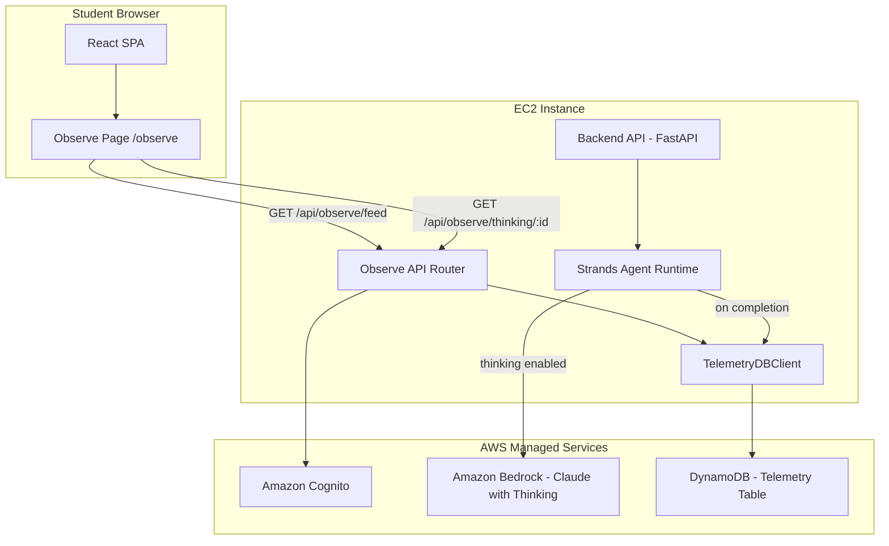
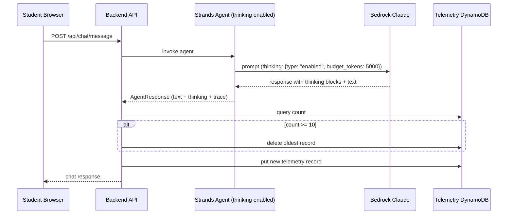

# Design Document

## Overview

This design adds an observability dashboard to the Bedrock AgentCore demo application. The dashboard provides a shared, supervisory view at `/observe` showing the last 10 inference requests across all students, with drill-down into the model's extended thinking (chain-of-thought reasoning). Telemetry persists in a dedicated DynamoDB table with a rolling window of 10 records.

### Key Design Decisions

1. **Extended thinking via Strands SDK**: Enable Claude's `thinking` parameter through `BedrockModel` configuration, capturing internal reasoning alongside responses.
2. **Separate DynamoDB table**: Use a dedicated `agentcore-demo-telemetry` table rather than overloading the conversations table, keeping concerns separated and queries simple.
3. **Simple key design (PK: "TELEMETRY", SK: timestamp)**: All records share one partition since the dataset is tiny (max 10 items). Timestamp-based sort key provides natural ordering.
4. **Rolling window enforcement at write time**: On each new inference completion, query the count; if ≥10, delete the oldest before inserting. This keeps the table bounded without background cleanup.
5. **Shared visibility by design**: The observability feed returns all records regardless of who's asking—no user-based filtering. Every authenticated student sees the same 10 records.

## Architecture



### Telemetry Capture Flow



## Components and Interfaces

### 1. Telemetry DynamoDB Client (`backend/db/telemetry.py`)

**Responsibility**: CRUD operations on the `agentcore-demo-telemetry` table with rolling window enforcement.

```python
TELEMETRY_TABLE_NAME = "agentcore-demo-telemetry"
MAX_RECORDS = 10

class TelemetryRecord:
    """A single telemetry record stored in DynamoDB."""
    record_id: str          # UUID for unique identification
    student_email: str      # Who sent the request
    message_preview: str    # First 100 chars of user message
    total_latency_ms: float # End-to-end latency
    tool_call_count: int    # Number of tool invocations
    timestamp: str          # ISO 8601 timestamp (also used in SK)
    thinking_content: str   # Extended thinking text (may be empty)

class TelemetryDBClient:
    """Client for the telemetry DynamoDB table."""

    def put_record(self, record: TelemetryRecord) -> None:
        """Insert a telemetry record, enforcing rolling window.

        1. Query all records (PK = "TELEMETRY")
        2. If count >= 10, delete the item with the lowest SK (oldest)
        3. Put the new record with SK = "{timestamp}#{record_id}"
        """

    def get_feed(self) -> list[TelemetryRecord]:
        """Return all records ordered by timestamp descending."""

    def get_thinking(self, record_id: str) -> str | None:
        """Return extended thinking content for a specific record."""
```

**Table Design**:

| Attribute | Type | Key | Description |
|-----------|------|-----|-------------|
| `PK` | String | Partition Key | Always `"TELEMETRY"` |
| `SK` | String | Sort Key | `"{iso_timestamp}#{record_id}"` |
| `record_id` | String | — | UUID for the record |
| `student_email` | String | — | Email of the student who sent the request |
| `message_preview` | String | — | First 100 chars of user message (with ellipsis if truncated) |
| `total_latency_ms` | Number | — | Request latency in milliseconds |
| `tool_call_count` | Number | — | Number of tool calls made |
| `timestamp` | String | — | ISO 8601 timestamp |
| `thinking_content` | String | — | Extended thinking text (empty string if none) |

### 2. Observe API Router (`backend/api/observe.py`)

**Responsibility**: REST endpoints for the observability dashboard, requiring authentication.

```python
# API Interface
GET /api/observe/feed              # Returns last 10 telemetry records + average latency
GET /api/observe/thinking/{record_id}  # Returns thinking content for a specific record
```

**Feed Response Model**:
```python
class TelemetryFeedItem(BaseModel):
    record_id: str
    student_email: str
    message_preview: str
    total_latency_ms: float
    tool_call_count: int
    timestamp: str

class TelemetryFeedResponse(BaseModel):
    records: list[TelemetryFeedItem]  # Ordered by timestamp desc, max 10
    average_latency_ms: float          # Arithmetic mean of total_latency_ms

class ThinkingResponse(BaseModel):
    record_id: str
    thinking_content: str              # Empty string if no thinking available
    has_thinking: bool                 # Convenience flag
```

### 3. Extended Thinking Configuration (`agent/runtime.py` modification)

**Responsibility**: Enable the `thinking` parameter on the BedrockModel and extract thinking blocks from responses.

```python
def _create_model() -> BedrockModel:
    """Create the Bedrock model with extended thinking enabled."""
    return BedrockModel(
        model_id="us.anthropic.claude-sonnet-4-6",
        region_name="us-east-1",
        model_kwargs={
            "thinking": {
                "type": "enabled",
                "budget_tokens": 5000,
            }
        },
    )
```

**Thinking Extraction**: After the agent completes, iterate through the response content blocks looking for `thinking` type blocks:

```python
def extract_thinking_content(result) -> str:
    """Extract thinking content from agent result.

    Iterates through response message content blocks, collecting
    any blocks with type 'thinking' and concatenating their text.

    Returns empty string if no thinking blocks found.
    """
    if not result.message or not result.message.get("content"):
        return ""

    thinking_parts = []
    for block in result.message["content"]:
        if isinstance(block, dict) and block.get("type") == "thinking":
            thinking_parts.append(block.get("thinking", ""))
    return "\n".join(thinking_parts)
```

### 4. Telemetry Capture Integration (`backend/api/chat.py` modification)

**Responsibility**: After each inference completes (success or timeout), write a telemetry record.

```python
# After agent responds in send_message():
def _capture_telemetry(
    user_email: str,
    message: str,
    agent_response: AgentResponse,
) -> None:
    """Capture telemetry for the observability dashboard.

    Creates a TelemetryRecord and writes it to DynamoDB.
    Failures are logged but do not interrupt the user response.
    """
    try:
        record = TelemetryRecord(
            record_id=uuid.uuid4().hex,
            student_email=user_email,
            message_preview=truncate_message(message, max_length=100),
            total_latency_ms=agent_response.trace.total_latency_ms if agent_response.trace else 0.0,
            tool_call_count=agent_response.trace.tool_call_count if agent_response.trace else 0,
            timestamp=datetime.now(timezone.utc).isoformat(),
            thinking_content=agent_response.thinking_content or "",
        )
        telemetry_db = TelemetryDBClient()
        telemetry_db.put_record(record)
    except Exception as e:
        logger.warning("Failed to capture telemetry: %s", str(e))
```

### 5. Message Preview Truncation (`backend/utils/truncate.py`)

**Responsibility**: Truncate messages to a max length with ellipsis indicator.

```python
def truncate_message(message: str, max_length: int = 100) -> str:
    """Truncate a message to max_length characters.

    If the message exceeds max_length, truncate and append '...'
    The total output length is max_length + 3 (for the ellipsis)
    when truncation occurs, or the original length when it doesn't.

    Args:
        message: The original message text.
        max_length: Maximum characters before truncation (default 100).

    Returns:
        The message preview, with '...' appended if truncated.
    """
    if len(message) <= max_length:
        return message
    return message[:max_length] + "..."
```

### 6. Frontend Observe Page (`frontend/src/pages/ObservePage.tsx`)

**Responsibility**: Render the observability dashboard with feed table, average latency card, and thinking drill-down.

**Components**:
| Component | Description |
|-----------|-------------|
| `ObservePage` | Main page container with header, latency card, and feed table |
| `TelemetryTable` | Table displaying the 10 most recent inference requests |
| `LatencyCard` | Summary card showing rolling average latency |
| `ThinkingPanel` | Modal/slide-over panel showing extended thinking for selected record |

**State Management**:
```typescript
interface TelemetryFeedItem {
  record_id: string;
  student_email: string;
  message_preview: string;
  total_latency_ms: number;
  tool_call_count: number;
  timestamp: string;
}

interface ObserveState {
  records: TelemetryFeedItem[];
  averageLatencyMs: number;
  selectedRecordId: string | null;
  thinkingContent: string | null;
  isLoadingFeed: boolean;
  isLoadingThinking: boolean;
}
```

**Routing**: Add `/observe` to `App.tsx` protected routes, wrapped in `<RouteGuard>`.

### 7. Average Latency Computation

The average latency is computed server-side in the feed endpoint:

```python
def compute_average_latency(records: list[TelemetryRecord]) -> float:
    """Compute arithmetic mean of latency values.

    Returns 0.0 when the record list is empty (avoids division by zero).
    """
    if not records:
        return 0.0
    total = sum(r.total_latency_ms for r in records)
    return total / len(records)
```

## Data Models

### TelemetryRecord (DynamoDB Item)

```json
{
  "PK": "TELEMETRY",
  "SK": "2025-01-15T10:30:00.000Z#a1b2c3d4e5f6",
  "record_id": "a1b2c3d4e5f6",
  "student_email": "student@example.com",
  "message_preview": "What is the current price of AAPL stock and how does it compare to...",
  "total_latency_ms": 4523.7,
  "tool_call_count": 3,
  "timestamp": "2025-01-15T10:30:00.000Z",
  "thinking_content": "Let me think about this question. The user wants to know about AAPL..."
}
```

### API Response: Feed

```json
{
  "records": [
    {
      "record_id": "a1b2c3d4e5f6",
      "student_email": "student@example.com",
      "message_preview": "What is the current price of AAPL stock and how does it compare to...",
      "total_latency_ms": 4523.7,
      "tool_call_count": 3,
      "timestamp": "2025-01-15T10:30:00.000Z"
    }
  ],
  "average_latency_ms": 3876.2
}
```

### API Response: Thinking

```json
{
  "record_id": "a1b2c3d4e5f6",
  "thinking_content": "Let me think about this question...",
  "has_thinking": true
}
```

## Correctness Properties

*A property is a characteristic or behavior that should hold true across all valid executions of a system—essentially, a formal statement about what the system should do. Properties serve as the bridge between human-readable specifications and machine-verifiable correctness guarantees.*

### Property 1: Rolling window size invariant

*For any* sequence of telemetry record insertions, the telemetry table SHALL contain at most 10 records at any point in time. After each insertion, if the prior count was 10, the oldest record (by timestamp) SHALL have been removed.

**Validates: Requirements 2.3, 7.2, 7.3, 8.3**

### Property 2: Feed ordering by timestamp descending

*For any* set of telemetry records in the rolling window, the feed endpoint SHALL return them ordered by timestamp descending, such that for consecutive records `records[i]` and `records[i+1]`, the timestamp of `records[i]` is greater than or equal to the timestamp of `records[i+1]`.

**Validates: Requirements 2.2**

### Property 3: Telemetry record field completeness

*For any* telemetry record returned by the feed endpoint, the record SHALL contain a non-empty `student_email`, a `message_preview` (possibly empty string for edge cases), a `total_latency_ms` ≥ 0, a `tool_call_count` ≥ 0, and a non-empty `timestamp` in ISO 8601 format.

**Validates: Requirements 2.4, 8.2, 9.1**

### Property 4: Message preview truncation

*For any* message string, the preview produced by the truncation function SHALL satisfy: if the message length is ≤ 100 characters, the preview equals the original message; if the message length exceeds 100 characters, the preview equals the first 100 characters followed by "...".

**Validates: Requirements 3.1, 3.2**

### Property 5: Thinking content extraction preservation

*For any* agent response containing one or more thinking blocks, the extracted thinking content SHALL contain all thinking text from those blocks. *For any* agent response containing zero thinking blocks, the extracted thinking content SHALL be an empty string.

**Validates: Requirements 5.2, 5.3**

### Property 6: Average latency computation correctness

*For any* non-empty list of telemetry records with `total_latency_ms` values, the computed average latency SHALL equal the arithmetic mean (sum of all latencies divided by count). *For any* empty list, the computed average SHALL be 0.0.

**Validates: Requirements 6.1, 6.2, 6.3**

### Property 7: Telemetry persistence round-trip

*For any* valid telemetry record written to DynamoDB, reading all records from the table SHALL return a record with identical `record_id`, `student_email`, `message_preview`, `total_latency_ms`, `tool_call_count`, `timestamp`, and `thinking_content` values.

**Validates: Requirements 7.1**

### Property 8: Cross-user telemetry visibility

*For any* two distinct authenticated users A and B, if user A triggers an inference that produces a telemetry record, then user B querying the feed endpoint SHALL receive a response that includes user A's record (subject to the rolling window constraint).

**Validates: Requirements 8.1**

## Error Handling

### Backend API Error Handling

| Scenario | Behavior |
|----------|----------|
| Telemetry write failure | Log warning, continue returning user response (non-blocking) |
| Feed query failure | Return HTTP 500 with `{"error": "internal_error", "message": "..."}` |
| Thinking record not found | Return HTTP 404 with `{"error": "not_found", "message": "..."}` |
| Invalid/expired auth token | Return HTTP 401 with redirect hint to `/signin` |
| DynamoDB throttling | Retry with backoff (boto3 default), log if exhausted |

### Frontend Error Handling

| Scenario | Behavior |
|----------|----------|
| Feed fetch failure | Display "Unable to load telemetry" message with retry button |
| Thinking fetch failure | Display "Unable to load thinking content" in the panel |
| Auth expired while on /observe | Redirect to sign-in, preserve `/observe` as return URL |
| Empty feed (0 records) | Display empty state: "No inference activity yet" |

## Testing Strategy

### Unit Tests

**Backend unit tests** (pytest):
- `truncate_message` with various string lengths
- `compute_average_latency` with empty list, single item, multiple items
- `extract_thinking_content` with mock agent results (with/without thinking blocks)
- `TelemetryDBClient.put_record` rolling window enforcement (mocked DynamoDB)
- `TelemetryDBClient.get_feed` ordering (mocked DynamoDB)
- Observe router authentication checks (mocked Cognito)
- Telemetry capture resilience (DynamoDB failure does not crash response)

**Frontend unit tests** (Vitest):
- `ObservePage` renders table with mocked feed data
- `LatencyCard` displays formatted average
- `ThinkingPanel` shows content or "no reasoning available" message
- Route guard redirects unauthenticated users

### Property-Based Tests

Property-based tests using **Hypothesis** (Python) with minimum 100 iterations:

1. **Rolling window size invariant**: Generate random insert sequences, verify count ≤ 10
2. **Feed ordering**: Generate random timestamps, verify descending order after retrieval
3. **Telemetry record completeness**: Generate random records, verify all fields present
4. **Message preview truncation**: Generate random strings (0–500 chars), verify truncation rules
5. **Thinking content extraction**: Generate mock responses with varying thinking blocks
6. **Average latency computation**: Generate random latency lists, verify arithmetic mean
7. **Telemetry persistence round-trip**: Generate random records, write/read, verify equality
8. **Cross-user visibility**: Generate records from random users, verify all visible to any user

### Integration Tests

- End-to-end: send chat message → verify telemetry appears in feed
- Extended thinking: send message → verify thinking content retrievable via endpoint
- Rolling window: insert 12 records → verify only last 10 remain
- Authentication: verify 401 on observe endpoints without valid token
